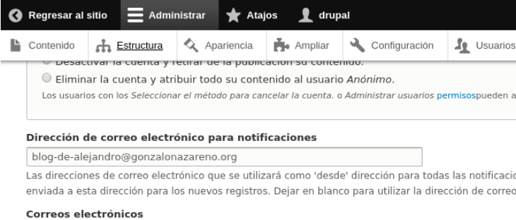
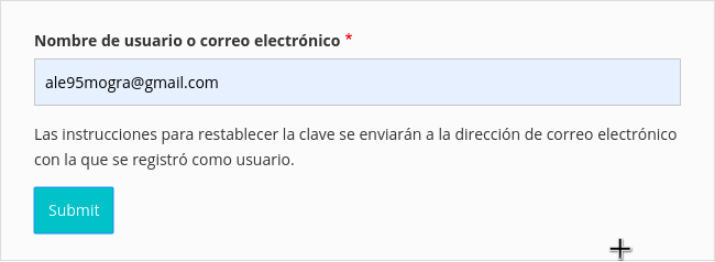
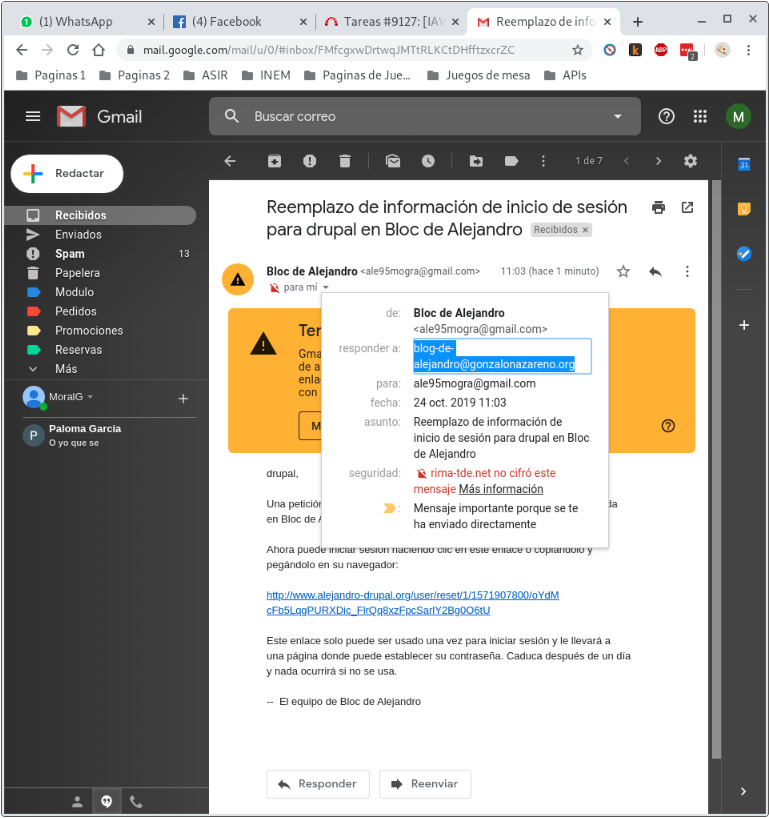

# Instalación local de un CMS PHP

### Tarea 1 : Instalación de un servidor LAMP

-------------------------------------------------------

##### Crea una instancia de vagrant basado en un box debian o ubuntu

~~~
# -*- mode: ruby -*-
# vi: set ft=ruby :

Vagrant.configure("2") do |config|

  config.vm.define :nodo1 do |nodo1|
    nodo1.vm.box = "debian/buster64"
    nodo1.vm.hostname = "LAMP"
    nodo1.vm.network :public_network,:bridge=>"enp3s0"
    #nodo1.vm.network :public_network,:bridge=>"wlp2s0"
  end
end
~~~

##### Instala en esa máquina virtual toda la pila LAMP

###### Instalamos apache2 y apache2-utils

~~~
sudo apt install -y apache2 apache2-utils
~~~

###### Instalamos el servidor y el cliente de mariadb

~~~
sudo apt install -y mariadb-server mariadb-client
~~~

###### Instalamos php y los módulos necesarios y recomendables de php

~~~ 
sudo apt install php libapache2-mod-php php-cli php-fpm php-json php-pdo php-mysql php-zip php-gd  php-mbstring php-curl php-xml php-pear php-bcmath
~~~

### Tarea 2: Instalación de drupal en mi servidor local

-------------------------------------------------------

1. Configura el servidor web con virtual hosting para que el CMS sea accesible desde la dirección: www.alejandro-drupal.org.

2. Descarga la versión que te parezca más oportuna de Drupal (7 o 8) y realiza la instalación.

3. Crea un usuario en la base de datos para trabajar con la base de datos donde se van a guardar los datos del CMS.

###### Vamos a descargar Drupal desde la pagina oficial

~~~
wget https://www.drupal.org/download-latest/zip
~~~

###### Creamos el directorio *drupal* en */var/www/*, descomprimimos el fichero descargado y copiamos su contenido en dicho directorio

~~~
sudo mkdir /var/www/drupal
sudo apt install unzip
sudo unzip zip
sudo mv drupal-8.7.8/* /var/www/drupal
~~~

###### Para crear un nuevo VirtualHost, para ello, nos vamos a */etc/apache2/sites-available*  y copiamos el default a drupal

~~~
sudo cp /etc/apache2/sites-available/000-default.conf /etc/apache2/sites-available/drupal.conf
~~~

###### Ahora dentro de este, editamos la dirección del DocumentRoot con el ServerName como se muestra a continuación

~~~
<VirtualHost *:80>

        ServerAdmin alejandro@drupal.com

        DocumentRoot /var/www/drupal

        ServerName 192.168.43.51

        <Directory "/var/www/drupal/">
                Options FollowSymLinks
                AllowOverride All
                Order allow,deny
                allow from all
                </Directory>

        ErrorLog /var/log/apache2/drupal-error_log
        CustomLog /var/log/apache2/drupal-access_log common
</VirtualHost>
~~~

###### Ahora para que funcione tenemos que crear una enlace simbólico del fichero dentro del directorio */etc/apache2/sites-enabled*

~~~
sudo a2ensite drupal
~~~

###### Cambiamos el usuario del directorio */var/www/drupal*

~~~
sudo chown -R www-data:www-data /var/www/drupal
~~~

###### Reiniciamos el sevicio

~~~
sudo service apache2 restart
~~~

###### Después en el cliente modificamos el fichero */etc/hosts* y añadimos la siguiente linea

~~~
172.22.6.186     www.alejandro-drupal.org
~~~

###### Vamos a crear una base de datos y un usuario para drupal y con privilegios, para ello configuramos el root en mariadb y cuando accedamos con root creamos lo dicho antes

~~~
sudo mysql_secure_installation
mysql -u root -p
mysql>create database drupaldb;
mysql>create user drupal;
mysql>GRANT ALL ON drupaldb.* TO drupal IDENTIFIED BY 'drupal';
~~~

###### Ahora vamos a instalar Drupal

* Ponemos el idioma en English para que no de problema con paquetes de traducción.
* Ponemos Standard, para que nos instale una configuración básica.
* Llegados a este punto, es cuando tendremos que poner el nombre de la base de datos, el usuario y contraseña que creamos anteriormente.
* Después pondremos varios datos que son necesarios, como nombre del sitio, cuente de mantenimiento y contraseña, email de administrador..etc.
* Y ya por último, pulsaremos en visitar nuestra página, y se nos mostrará nuestra página de Drupal.

4. Realiza una configuración mínima de la aplicación (Cambia la plantilla, crea algún contenido, …)

###### Para instalar un tema en Drupal tenemos que:

* Iniciar sección con nuestra cuenta.
* Hacemos clic en *Administrar*
* Hacemos clic en *Apariencia*
* Hacemos clic en *instalar nuevo tema*
* Pegamos el siguiente enlace, que es un tema: https://ftp.drupal.org/files/projects/drupal8_zymphonies_theme-8.x-1.4.tar.gz
* Ahora buscamos nuestro tema descargado y hacemos clic en *Instalar y seleccionar de modo predeterminado*

5. Instala un módulo para añadir alguna funcionalidad a drupal.

###### Para instalar un módulo es igual que el tema, pero añadiendo la url de un módulo que queramos

### Tarea 3: Configuración multinodo

-------------------------------------------------------

1. Realiza un copia de seguridad de la base de datos

###### Creamos una copia de seguridad del la base de datos *drupaldb* con el usuario *drupal*

~~~
mysqldump -v --opt --events --routines --triggers --default-character-set=utf8 -u drupal -p drupaldb > drupal_copia_`date +%Y%m%d_%H%M%S`.sql
~~~

2. Crea otra máquina con vagrant, conectada con una red interna a la anterior y configura un servidor de base de datos.

###### Instalamos mariadb como en la anterior tarea

3. Crea un usuario en la base de datos para trabajar con la nueva base de datos.

###### Creamos el usuario como en la anterior tarea y la base de datos

4. Restaura la copia de seguridad en el nuevo servidor de base datos.

###### Restauramos la base de datos con el siguiente comando

~~~
sudo mysql -u drupal --password=drupal drupaldb < drupal_copia_20191020_092005.sql
~~~

5. Desinstala el servidor de base de datos en el servidor principal.

###### Desinstalamos mariadb

~~~
 sudo apt purge mariadb-*
~~~

6. Realiza los cambios de configuración necesario en drupal para que la página funcione.

###### Realizamos los mismos cambios que en el ejercicio anterior pero con algunas escepciones

###### Tenemos que modificar un linea del fichero */var/www/drupal/sites/default/settings.php * para que en vez de "localhost" poner la dirección del servidor donde hemos migrado la base de datos

~~~
$databases['default']['default'] = array (
  'database' => 'drupaldb',
  'username' => 'drupal',
  'password' => 'drupal',
  'prefix' => '',
  'host' => '192.168.100.2',
  'port' => '3306',
  'namespace' => 'Drupal\\Core\\Database\\Driver\\mysql',
  'driver' => 'mysql',
);
~~~

###### Ademas tenemos que configurar mysql para que se pueda acceder de forma remota, para ello, tenemos que modificar el fichero */etc/mysql/mariadb.conf.d/50-server.cnf * y modificar la linea siguiente

~~~
bind-address            = 0.0.0.0
~~~

### Tarea 4: Instalación de otro CMS PHP

-------------------------------------------------------

1. Elige otro CMS realizado en PHP y realiza la instalación en tu infraestructura.
2. Configura otro virtualhost y elige otro nombre en el mismo dominio.

###### Creamos nuevo usuario y base de datos y le asignamos los permisos necesarios

###### El nuevo CMS que voy a utilizar es *PrestaShop*

###### Lo descargamos de la página oficial y nos devuelve un fichero *.zip* que tenemos que descomprimir

~~~
unzip prestashop_1.7.6.1.zip
~~~

###### Y lo movemos a un directorio Documentroot

~~~
sudo mkdir /var/www/prestashop
sudo mv index.php Install_PrestaShop.html prestashop.zip /var/www/prestashop/
~~~

###### Configuramos el virtualhost para prestashop

~~~
sudo cp /etc/apache2/sites-available/drupal.conf /etc/apache2/sites-available/prestashop.conf
~~~

###### Y metemos dentro esto

~~~
<VirtualHost *:80>

        ServerAdmin alejandro@prestashop.com

        DocumentRoot /var/www/prestashop

        ServerName www.alejandro-prestashop.org

        <Directory "/var/www/prestashop/">
                Options FollowSymLinks
                AllowOverride All
                Order allow,deny
                allow from all
                </Directory>

        ErrorLog /var/log/apache2/drupal-error_log
        CustomLog /var/log/apache2/drupal-access_log common
</VirtualHost>
~~~

###### Metemos en el fichero del cliente de hosts esto

~~~
172.22.6.186  www.alejandro-prestashop.org
~~~

###### Añadimos los permisos al usuario *www-data* a todo el documentroot

~~~
sudo chown -R www-data:www-data /var/www/prestashop
~~~

###### Creamos el enlace simbólico y reiniciamos el servicio apache2

~~~
sudo a2ensite prestashop
sudo service apache2 restart
~~~

###### Ahora estará todo listo para instalar *Prestashop* pero tenemos que solucionar varios errores

###### Activar módulo mod_rewrite

~~~
sudo a2enmod rewrite
sudo /etc/init.d/apache2 restart
~~~

###### Instalar y activar la extensión intl

~~~
sudo apt-get install php7.3-intl
sudo /etc/init.d/apache2 restart
~~~

### Tarea 5: Necesidad de otros servicios

-------------------------------------------------------

1. La mayoría de los CMS tienen la posibilidad de mandar correos electrónicos (por ejemplo para notificar una nueva versión, notificar un comentario,…)
Instala un servidor de correo electrónico en tu servidor. debes configurar un servidor relay de correo, para ello en el fichero /etc/postfix/main.cf, debes poner la siguiente línea

~~~
relayhost = babuino-smtp.gonzalonazareno.org
~~~

2. Configura alguno de los CMS para utilizar tu servidor de correo y realiza una prueba de funcionamiento.

###### Instalamos postfix

~~~
sudo apt install postfix
~~~

###### Le indicamos en la instalación que sea *internet site* y luego le indicamos *alejandro.gonzalonazareno.org*

###### Copiamos lo indicado en el enunciado en el fichero */etc/postfix/main.cf*

~~~
relayhost = babuino-smtp.gonzalonazareno.org
~~~

###### Comprobamos lo errores con el comando *mailq* y si todo esta bien nos debería de indicar *Mail queue is empty*

~~~
mailq
      Mail queue is empty
~~~

###### Cambiamos en drupal la configuración de la dirección de correo electrónico para notificaciones

> 

###### Solo solo nos queda comprobar si funciona, para esto vamos a hacer que nos recuerde la contraseña en drupal y le indicamos nuestro correo

> 

###### Revisamos nuestro correo para comprobar si ha llegado correctamente

> 