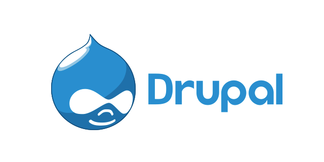

# Instalación local de un CMS PHP (Drupal)

#### Esta tarea consiste en instalar un CMS de tecnología PHP (drupal 7 o drupal 8) en un servidor local. Los pasos que tendrás que dar los siguientes:

### Tarea 1: [Instalación de un servidor LAMP](https://github.com/MoralG/Instalacion_local_CMS_PHP_Drupal/blob/master/CMS_PHP_Drupal.md#tarea-1--instalaci%C3%B3n-de-un-servidor-lamp)
* Crea una instancia de vagrant basado en un box debian o ubuntu
* Instala en esa máquina virtual toda la pila LAMP

### Tarea 2: [Instalación de drupal en mi servidor local](https://github.com/MoralG/Instalacion_local_CMS_PHP_Drupal/blob/master/CMS_PHP_Drupal.md#tarea-2-instalaci%C3%B3n-de-drupal-en-mi-servidor-local)
* Configura el servidor web con virtual hosting para que el CMS sea accesible desde la dirección: www.nombrealumno-drupal.org.
* Crea un usuario en la base de datos para trabajar con la base de datos donde se van a guardar los datos del CMS.
* Descarga la versión que te parezca más oportuna de Drupal (7 o 8) y realiza la instalación.
* Realiza una configuración mínima de la aplicación (Cambia la plantilla, crea algún contenido, …)
* Instala un módulo para añadir alguna funcionalidad a drupal.

### Tarea 3: [Configuración multinodo](https://github.com/MoralG/Instalacion_local_CMS_PHP_Drupal/blob/master/CMS_PHP_Drupal.md#tarea-3-configuraci%C3%B3n-multinodo)
* Realiza un copia de seguridad de la base de datos
* Crea otra máquina con vagrant, conectada con una red interna a la anterior y configura un servidor de base de datos.
* Crea un usuario en la base de datos para trabajar con la nueva base de datos.
* Restaura la copia de seguridad en el nuevo servidor de base datos.
* Desinstala el servidor de base de datos en el servidor principal.
* Realiza los cambios de configuración necesario en drupal para que la página funcione.

### Tarea 4: [Instalación de otro CMS PHP](https://github.com/MoralG/Instalacion_local_CMS_PHP_Drupal/blob/master/CMS_PHP_Drupal.md#tarea-4-instalaci%C3%B3n-de-otro-cms-php)
* Elige otro CMS realizado en PHP y realiza la instalación en tu infraestructura.
* Configura otro virtualhost y elige otro nombre en el mismo dominio.

### Tarea 5: [Necesidad de otros servicios](https://github.com/MoralG/Instalacion_local_CMS_PHP_Drupal/blob/master/CMS_PHP_Drupal.md#tarea-5-necesidad-de-otros-servicios)
* La mayoría de los CMS tienen la posibilidad de mandar correos electrónicos (por ejemplo para notificar una nueva versión, notificar un comentario,…)
* Instala un servidor de correo electrónico en tu servidor. debes configurar un servidor relay de correo, para ello en el fichero /etc/postfix/main.cf, debes poner la siguiente línea:
~~~
relayhost = babuino-smtp.gonzalonazareno.org
~~~
* Configura alguno de los CMS para utilizar tu servidor de correo y realiza una prueba de funcionamiento.
